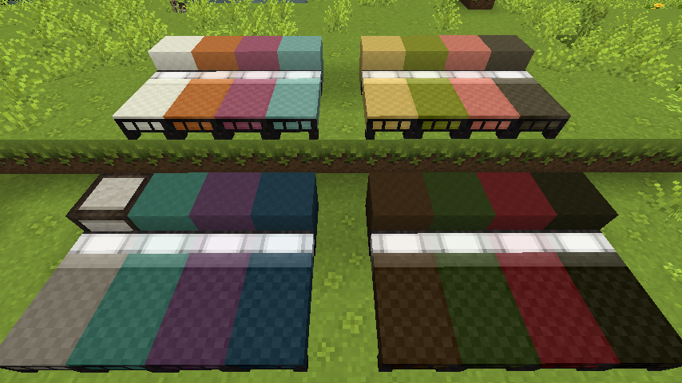
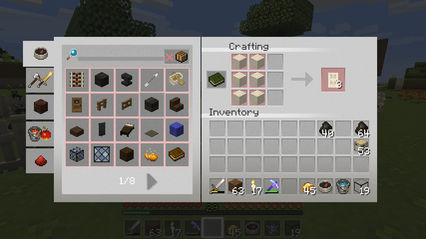
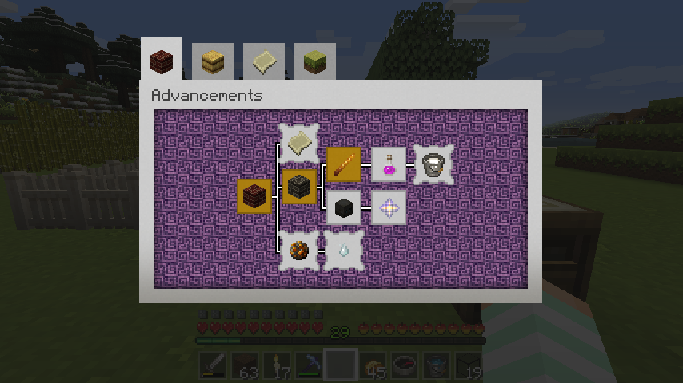

# Mizuno's 16 craft (Unofficial Fork for Minecraft 1.12/1.11.2)

This is a Minecraft Resource pack.
Originally designed and published by Mizuno.

## Screenshots

Beds:

* white, orange, magenta, light blue / yellow, lime, pink, gray.
* light gray, cyan, purple, blue / brown, green, red, black.

Recipe book:

Advancements:

## Download

Resource pack files can be retrieved from following page:

* https://github.com/hio/minecraft-mizunos16craft/releases

## Updated materials

* Advancement window. (1.12)
* Colored beds. (1.12)
* Recipe book window. (1.12)
* Knowledge book item. (1.12)
* Inventory window of shulker box. (1.11)
* Statistics icons.

## Build resource pack by hand

    $ make

To build resource pack file from source files in this repository,
some POSIX command-line tools are required:

* make
* zip
* rsync
* /bin/sh (POSIX compatible shell)
* etc.

Image files are edited with GIMP graphics editor.
Files with extension ".xcf" are saved files by GIMP.

## License

このリソースパックは クリエイティブ・コモンズ 表示 - 非営利 - 継承 4.0 国際
ライセンスの下に提供されています.
原作者のクレジット（製作者:Mizuno、タイトル:Mizuno's 16 Craft、配布ページURL）
を明記し、かつ非営利目的に限り、また改変を行った際には、元の作品と同じ組み合
わせのCCライセンスで公開することを主な条件に改変したり再配布したりすることが
出来ます.
改変したものの配布、再配布の際にはadflyなどのアフィリエイトを利用しないでくだ
さい.
このリソースパックを使用して生じたいかなる損害に対しても制作者は責任を負いま
せん.

Original site:

* http://mizunomcmemo.blogspot.jp/p/resourcepack.html
* http://forum.minecraftuser.jp/viewtopic.php?f=14&t=30945

This Resource Pack is licensed under a Creative Commons Attribution-
NonCommercial-ShareAlike 4.0 International License.
When you distribute or redistribute this pack, do not put an affiliate
links such as adfly.
Accept no responsibility for any loss resulting from this ResourcePack.
